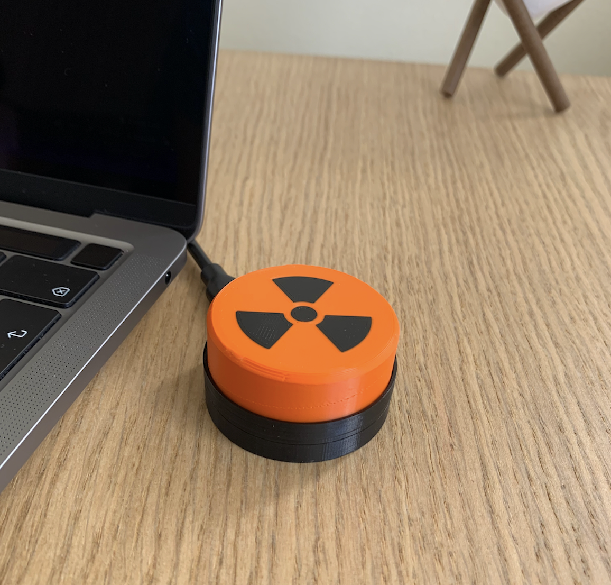

# Big Orange Button a.k.a BOB
Big Orange Button (BOB for short) is a customisable single-key USB keyboard


## Hardware
To build this project you need access to a 3d printer. The model folder contains 3 parts.

### Bill of materials
* Pimoroni Tiny 2040 (x1)
* Keyboard switch (x1)
* M3x12 screw (x2)
* Connection wire

### Print
The 3d models can be downloaded from my Printables [here](https://www.printables.com/social/306904-dmytro-panin/models).

### Assembly
1. Populate the slot of the _bob_middle_ printed part with an MX-type keyboard switch.

2. Solder the microcontroller to the switch one wire should be connected to the PD7 pin of the microcontroller and the other one to the GND pin, make sure that wires are soldered to the top side of your Tiny.
3. Insert the microcontroller into its slot in the _bob_bottom_ printed part.
4. Secure the microcontroller with the _bob_middle_ printed model.
5. Screw together the _bob_bottom_ and _bob_middle_ parts with the m3 screws.
6. Put on the 3d printed _bob_plain_button_ on the key switch' tip.
7. Optionally, you can stick some rubber feet on the bottom side of the device.

## Software
### Installing CircuitPython 
The software is written in CircuitPython 7.3.1 and uses the HID module of CircuitPython Library Bundle.
1. Download the CircuitPython UF2 from the official website [here](https://circuitpython.org/board/pimoroni_tiny2040/).
2. Push and hold the BOOTSEL button and plug your Tiny 20240 into the USB port of your computer. Release the BOOTSEL button after your microcontroller is connected.
3. It will mount as a Mass Storage Device called RPI-RP2.
4. Drag and drop the CircuitPython UF2 file onto the RPI-RP2 volume. 

### Installing HID libraries
1. Download the library bundle for the CircuitPython version you installed 7.x by default from [here](https://circuitpython.org/libraries)
2. Unzip the bundle; Copy `adafruit_hid` from the `lib` folder to `<CIRCUITPY DRIVE>/lib/`

### Software installation
1. Download the software
```shell
cd ~
git clone https://github.com/dr-mod/bob.git
cp bob/src/*.py <CIRCUITPY DRIVE>
```

### Configuration
To configure action modify `key_mapping.py`

At the moment there are 3 types of commands supported:
* STRING - a sequence of characters printed when a button is pressed _e.g. "Hello, world!"_
* KEY - a single key or combination of keys e.g. _A_ or _Ctrl + C_. [List](https://circuitpython.readthedocs.io/projects/hid/en/latest/_modules/adafruit_hid/keycode.html) of supported keycodes.
* CONTROL_CODE - a control commands e.g. increase brightness, [List](https://circuitpython.readthedocs.io/projects/hid/en/latest/api.html#adafruit-hid-consumer-control-code-consumercontrolcode) of supported control codes.

#### Example configuration:
```python
(STRING, "sudo shutdown now \n"),
```

### Additional information
This project has uses a modified version of my other project [pico-mpad](https://github.com/dr-mod/pico-mpad) you can find more configuration examples and information there. 

### Support the project
If you would like to support what I do and keep me caffeinated, you can do it here:

[](https://www.buymeacoffee.com/drmod)
